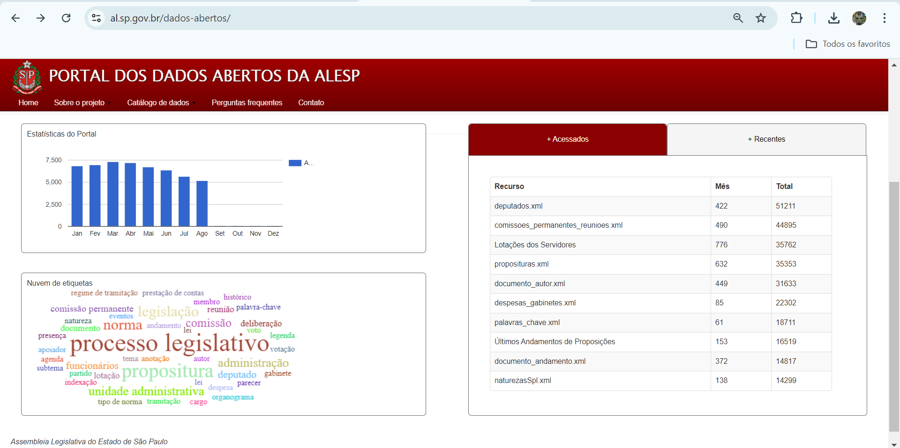
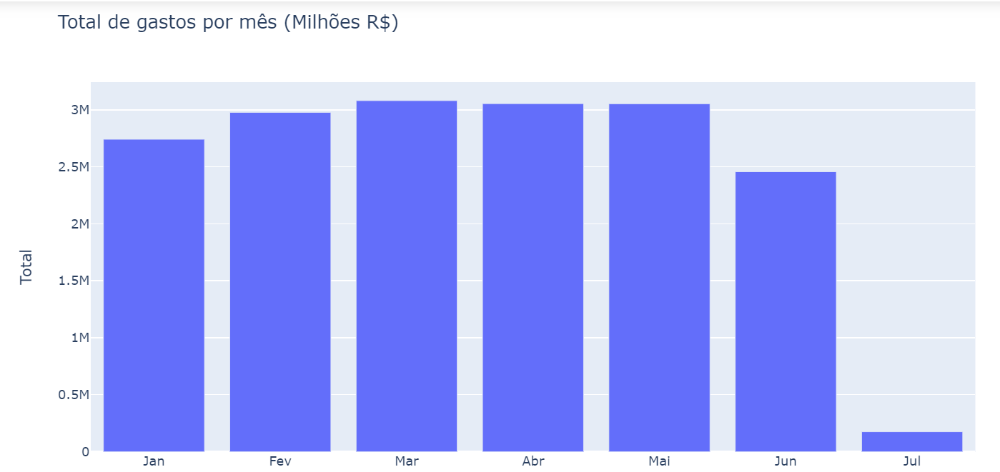
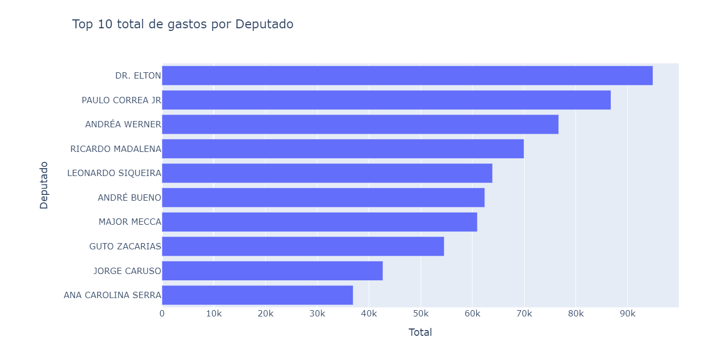
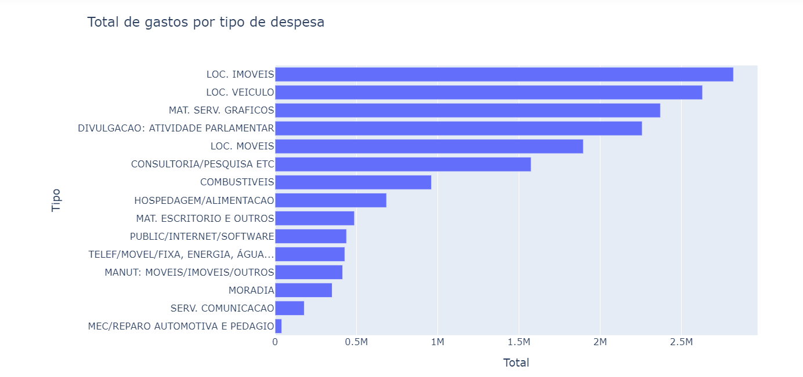

### Orientações

- A fonte da base de dados no formato XML, [despesas_gabinete.xml.](https://www.al.sp.gov.br/repositorioDados/deputados/despesas_gabinetes.xml])

- A documentação com o metadados e detalhes estão no arquivo **despesas_gabinetes_documentacao.pdf**
- O script foi criado em Python e deve utilizar as bibliotecas: Pandas e Plotly-express ou outra biblioteca para gerar os gráficos:
    - Pandas para manipular os dados
    - Plotly-Express para gerar os gráficos
- Além da base em XML, há um arquivo que foi gerado após adicionar os campos Nome_Mes e Tipo_Abreviado **despesas_gabinete.csv** com o encoding é **Latin-1** os campos são separados por **ponto e vírgula ;**
- O arquivo **analise_despesas_gabinete.ipynb** possui o script em Python no Jupyter Notebook, mas pode executar em qualquer editor/IDE da sua preferência ou pode copiar o script do arquivo **analise_despesas_gabinete.html**.

 
 

 

 

 

 
 
###### Use a sua criatividade contribuia com novos insights, aidicione novas bases de dados e relacione os dados com o nome do partido etc. 
